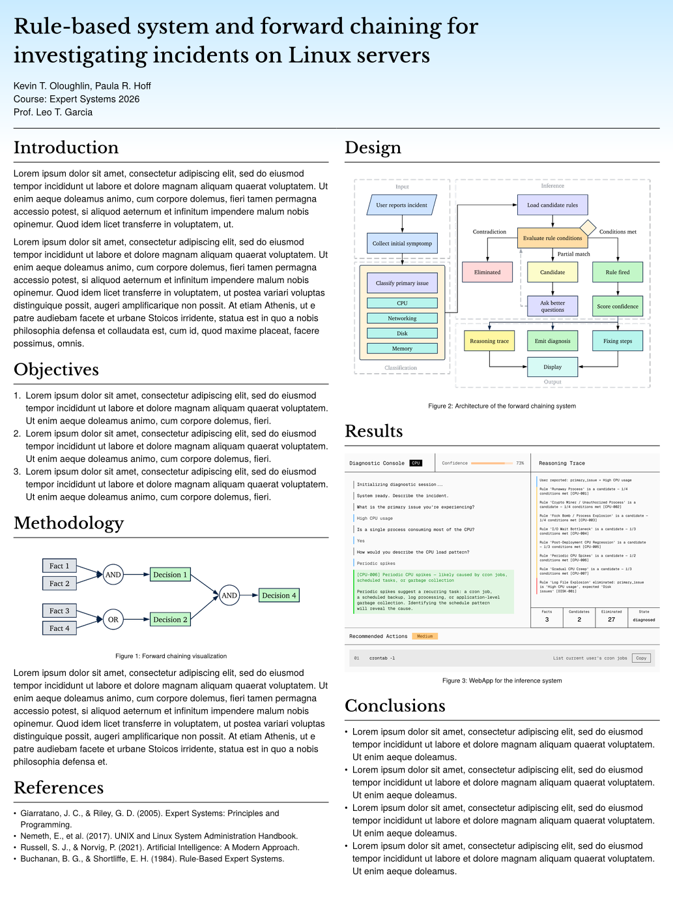

# Pasquino (Poster Template)

A clean, modern, two-column academic research poster template designed for Typst (75x100 cm). Optimized for university project presentations, research showcases, and conference poster sessions.

---

## Features

- **Standard Poster Dimensions:** Pre-configured for standard 75 cm × 100 cm poster prints.
- **2-Column Responsive Layout:** Built using native column flow with intuitive column-breaking support.
- **Built-in Color Themes:** Easily switch between preset header color gradients (`"blue"`, `"green"`, `"red"`, `"purple"`, `"orange"`) or supply your own custom gradient/color.
- **Flexible Header:** Automatically aligns title, author information, course/professor details, and an optional university or institutional logo.
- **Semantic Components:** Concise `#section(title: "...")[content]` blocks for clean, readable markup.

---

## Quick Start

### Using the Typst CLI

Initialize a new project directly from Typst Universe:

~~~bash
typst init @preview/uniminuto-poster:0.1.0 my-poster
cd my-poster
typst watch main.typ
~~~

### Manual Import

If you already have a Typst document, import the package directly at the top of your `.typ` file:

~~~typst
#import "@preview/uniminuto-poster:0.1.0": poster, section, pos-colbreak

#show: poster.with(
  title: [Rule-based system and forward chaining for\ investigating incidents on Linux servers],
  authors: ("Santiago Vergara de Los Rios", "Juan Camilo Zuluaga"),
  course: "Sistemas Expertos 2026-1",
  professor: "Luis Fernando Londoño",
  logo: "logo.png",
  theme: "green",
)

#section(title: "Introduction")[
  Your text and figures go here.
]

#pos-colbreak()

#section(title: "Results")[
  Content for the right column.
]
~~~

---

## Configuration & Parameters

### `poster(...)` Options

| Parameter | Type | Default | Description |
| :--- | :--- | :--- | :--- |
| `title` | `content` / `str` | `""` | Main title of the poster. Can include line breaks (`\`). |
| `authors` | `array` of `str` | `()` | List of author names (automatically joined with commas). |
| `course` | `str` | `""` | Course name or project context (e.g., `"Sistemas Expertos 2026-1"`). |
| `professor` | `str` | `""` | Advisor or professor name. |
| `logo` | `str` / `image` / `none` | `none` | Path to logo image file or an `image(...)` element. |
| `theme` | `str` / `color` / `gradient` | `"blue"` | Preset name (`"blue"`, `"green"`, `"red"`, `"purple"`, `"orange"`) or custom gradient. |

---

## Customizing Color Themes

### Built-in Presets
You can pass a string identifier to the `theme` parameter:
~~~typst
#show: poster.with(
  ...
  theme: "red", // Built-in preset
)
~~~

### Custom Linear or Radial Gradients
Pass any standard Typst gradient directly to `theme`:
~~~typst
#show: poster.with(
  ...
  theme: gradient.linear(rgb("#11998e"), rgb("#38ef7d"), angle: 45deg),
)
~~~

---

## License

This template is released under the [MIT License](LICENSE).
